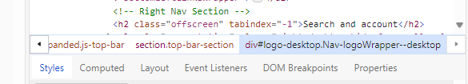

** Assignment 2: Inspecting the Web**

* I looked at the digital library of Illinois. They used HTML to build the tool. I know this because when I inspected, it said it's doctype is html. Looking at the file there is a lot of sections under the intial html format.
* I was unable to find out how many people worked on the website, but for the intial code I do not see any comments that tell me there were multiple poeple who made it.